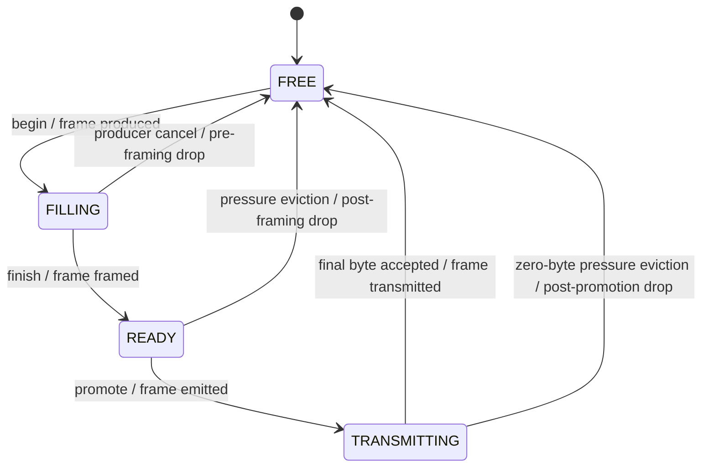

# Acquisition pipeline

## Status and scope

Phase 08 began with one portable `acquisition::Controller` around the proven
Phase 06 GPIO and Phase 07 ADC engines. It is now the only firmware-runtime
boundary that initializes, preflights, starts, stops, drains, services, and
publishes telemetry for physical acquisition. `FirmwareRuntime` retains the
control protocol, synthetic source, common packet pool, and USB scheduler but
no longer owns per-peripheral lifecycle state or sequencing.

The controller preserves the accepted ADC-only and GPIO-only behavior and now
executes an ADC-plus-GPIO request as one atomic internal resource transaction.
It owns one run ID, one 8 MHz epoch, and one shared hardware schedule across
both paths. [[Protocol-V1]] now advertises and validates the exact hardware and
synthetic ADC-only, GPIO-only, and combined profile matrix, publishes its
complete fixed resource metadata, and exposes the controller/packet/USB
telemetry through INFO and STATUS. The dedicated synthetic plus 10/60-second
physical campaign is accepted in [[Phase-08-Combined-Acquisition]].

Phase 09 closes the diagnostic boundary around that pipeline. Every ownership
stage now has a current-depth or cumulative counter, every deliberate discard
has an exact source and stage, and the host can reconcile a stopped or live
STATUS snapshot without inferring units from field names. The fixed wire
layout and reset rules remain normative in [[Protocol-V1]].

## Evidence reinspected

The audit used the checked-in [[Firmware-Resource-Map]], the current target
adapters, the exact linker-verified Phase 07 image, and the accepted physical
results in [[Phase-06-GPIO-DMA]] and [[Phase-07-Dual-ADC]]. It also reinspected
the pinned Teensy core 1.62.0 `IntervalTimer` and `DMAChannel` implementations
and the bundled `OctoWS2811` XBAR/eDMA setup.

| Evidence | Retained conclusion |
| --- | --- |
| [[ADR-003-GPIO-Clock-DMA]] and Phase 06 target results | PIT0 at 24 MHz / 6 produces the verified 4 MHz GPIO master; XBARA1 output 0, DMAMUX 30, and eDMA 2 are the accepted rising-edge path. |
| [[ADR-004-ADC-Trigger-DMA]] and Phase 07 target results | Chained PIT1 divides the same master by four; ADC_ETC queues 0/4 feed fixed eDMA 0/1 and passed 1 MS/s-per-converter capture. |
| Pinned `IntervalTimer.cpp` | It dynamically takes an unused PIT channel and cannot enforce this project's PIT0/PIT1 ownership; it remains excluded. |
| Pinned `DMAChannel.cpp` | Its allocator and priority helpers are dynamic; acquisition continues to bind channels 0, 1, and 2 directly. |
| Pinned `OctoWS2811_imxrt.cpp` | Its selective GPIO remap/cache/TCD patterns remain useful precedent, but it collides with XBAR DMA outputs 0-2 and sources 30/31/94 and cannot coexist. |
| Current packet and ownership modules | The existing fixed packet pool, alternating ready-frame promotion, source-specific sequences, DMA rings, cache transitions, and complete-frame USB continuation are reusable without another buffer layer. |

No new timing or electrical claim is inferred from this code refactor. The
latest target evidence remains the single-source Phase 06/07 campaigns, and
their unstimulated-input limitations still apply.

## One clock tree, distinct data routes

The apparent PIT0 collision is intentional clock sharing. It must have one
schedule owner rather than two independently started timer owners:

```text
24 MHz PERCLK
    |
    +-> PIT0, LDVAL=5, 4 MHz master
         |
         +-> XBARA1 input 56 -> output 0 -> DMAMUX 30 -> eDMA 2
         |                                           -> GPIO2_PSR ring
         |
         +-> chained PIT1, LDVAL=3, 1 MHz pair event
              |
              +-> XBARA1 input 57 -> output 103 -> ADC_ETC 0
              |                                      -> ADC1 -> eDMA 0
              |
              +-> XBARA1 input 57 -> output 107 -> ADC_ETC 4
                                                     -> ADC2 -> eDMA 1
```

GPIO and ADC do not compete for XBAR outputs, ADC_ETC queues, DMAMUX sources,
or eDMA channels. They do share PIT0 configuration and enable state. The ADC
trigger adapter configures the complete stopped PIT0/PIT1 schedule and reuses
`gpio_dma_route_teensy.h` for the 24 MHz root. GPIO standalone operation keeps
its `prepare`-then-PIT0-start convenience path. Combined operation uses the
split GPIO `prepare()` path, which configures the raw ring, cache ownership,
eDMA channel 2, DMAMUX 30, XBAR output 0, and input-safe pin mapping while
leaving PIT0 stopped. The ADC trigger scheduler is then the only schedule
owner.

The documented combined START commit order is:

1. validate the full fixed physical configuration and perform read-only
   resource inspection for both paths;
2. reserve the controller run ID, stream mask, and epoch after verifying the
   common packet epoch;
3. reset both packers to that run ID and epoch;
4. reset and prime the ADC paired-DMA ring and channels 0/1;
5. reset and prime the GPIO raw-DMA ring and channel 2, including XBAR/DMAMUX,
   while PIT0 remains stopped;
6. reload and clear PIT0/PIT1, enable ADC_ETC queues, enable chained PIT1, and
   enable PIT0 last to commit the shared schedule.

Every failure before the final commit unwinds all owners prepared so far,
stops common packet production, and clears the reserved run identity. A failed
final arm performs trigger cleanup before the controller quiesces GPIO DMA,
ADC DMA, both packers, and the packet epoch.

## Compile-time conflict contract

`board::kAcquisitionResourceContract` is the aggregate compile-time result.
The controller copies it into every audit, while `static_assert` prevents an
invalid production contract from compiling.

| Resource class | Compile-time checks | Accepted allocation |
| --- | --- | --- |
| Pins | Board range, duplicate pin/pad/port-bit rejection, exact protocol order, fixed converter tuples | A0/D14, A1/D15, and D6-D13 are disjoint |
| PIT | Range and duplicate channel rejection | PIT0 master and chained PIT1 |
| XBAR | Input/output range and unique output rejection; repeated input fan-out allowed | GPIO output 0; ADC outputs 103/107 |
| ADC_ETC | Queue/peripheral range and uniqueness | Queue 0/ADC1 and queue 4/ADC2 |
| eDMA/DMAMUX | Range plus unique channel/source rejection | ADC 0/24, ADC 1/88, GPIO 2/30 |
| DMA arbitration | Distinct fixed priorities; larger numeric value wins | ADC0 2, ADC1 1, GPIO 0 |
| NVIC priorities | Complete logical allocation, equal ADC generation/error priority, ADC before GPIO | production ADC 48; GPIO 64 |
| BOOT diagnostic poll | Bounded ITCM status observation while all interrupts are briefly masked | ADC_ETC completion/error IRQs remain disabled; production ownership is untouched |
| DMA memory | Nonzero power-of-two alignment, unique use, RAM1/RAM2 budgets, DMA destinations in OCRAM | ADC/raw-GPIO rings, sinks, and TCD banks in RAM2 |
| Cache regions | Every DMA/cache-sensitive allocation occupies complete 32-byte lines | DMA rings/sinks/TCDs, packet banks, packed GPIO, diagnostic and checksum buffers |

Host compile tests include negative contracts for duplicate interrupt users,
unsafe IRQ ordering, a reused eDMA arbitration priority, a DMA ring placed in
DTCM, and an under-aligned cached ring. Existing negative tests continue to
cover every pin, PIT, XBAR, ADC_ETC, eDMA, DMAMUX, size, and alignment
collision.

## Runtime atomic preflight

`Controller::inspect(configuration, next_run_id)` performs no arm, route,
cache, DMA, or timer write. For every requested physical source it checks:

1. a recognized hardware-only stream profile, exact fixed frame size, and
   supported data checksum;
2. a nonzero prospective run ID and the complete static contract above;
3. controller active, draining, and start-reservation state;
4. presence of the capture, packer, and trigger components;
5. stopped/ready ADC trigger evidence;
6. packer quiescence;
7. each target facade's read-only `inspectStart()` result.

The target facade checks cover live PIT/ADC_ETC activity and ADC conversion
state, eDMA request bits, ADC DMA enables, DMAMUX enables, the GPIO XBAR request
state, raw-ring quiescence, and nonzero ADC epoch. A resource-busy result is
projected into the existing per-source conflict counter. For a combined plan,
both engine inspections always run and either failure rejects the whole audit
before the controller reserves or mutates an owner. Immediately before START,
the controller also verifies that packet production already owns the same run
ID and requested checksum.

## Controller ownership

The controller composes storage-owning modules rather than replacing them:

```text
ControlState START event
    -> common PacketBufferPipeline epoch
    -> acquisition::Controller
         -> ADC packer -> paired ADC DMA ring -> ADC trigger scheduler
         -> GPIO packer -> raw GPIO DMA ring
    -> fair ready-frame promotion
    -> response-first CDC transport
```

For single-source and internally executable combined runs, the controller
preserves these invariants:

- one nonzero run ID is the DMA ownership epoch and packet run identity;
- packer and DMA storage are armed before a source trigger is enabled;
- ADC STOP requests a paired DMA boundary, disables the trigger schedule, then
  tears down DMA;
- GPIO STOP retains its accepted complete-boundary behavior and restores input
  safety;
- combined STOP and fault disable the shared PIT/ADC_ETC source first, quiesce
  GPIO DMA and restore GPIO inputs, then quiesce ADC DMA;
- complete old-run raw and packed work drains before packet production stops,
  while the capture rings account for and discard only an incomplete active
  DMA buffer;
- CONFIGURE/START remain busy until raw, packed, packet, and USB ownership are
  quiescent;
- raw and packer telemetry is published only when its run ID matches the
  current statistics generation.

The run identity remains reserved through the complete-frame drain and is
cleared only when both source paths are quiescent. Hardware capture faults and
packer source/pipeline faults enter the same source-first stop path. The
runtime then returns protocol state to IDLE and consumes the generated STOP
event in the same cooperative visit, making cleanup retryable without exposing
a stale RUNNING state.

The physical report is now a base of the cooperative runtime report, so all
existing status flags and lifecycle tests remain source compatible while the
sequencing implementation has one owner.

## Combined packet and USB scheduling

The common packet epoch now snapshots the configured stream mask together with
the run ID and checksum. A producer for a disabled stream is rejected before
it can reserve a packet buffer, and the acquisition controller refuses to arm
if its complete requested mask differs from the packet epoch. ADC-only and
GPIO-only runs therefore use the same queues without waiting for an absent
peer, while combined runs enable equal-coverage scheduling.

Each ADC frame and GPIO frame covers exactly 8,096 timestamp ticks. During an
active combined run, ready-frame promotion compares each source's cumulative
`emitted + dropped` frame count. It may promote a source whose accounted
coverage is tied with or behind its peer, which permits at most a one-frame
lead. A counted source drop consumes its independent sequence and fairness
slot, so retained coverage can advance without pretending that the missing
frame existed. At equal coverage the existing rotating preference alternates
ADC and GPIO. Once production stops, the coverage wait is relaxed and every
remaining complete frame drains; STOP cannot strand a legitimate unmatched
tail.

The downstream CDC rules remain unchanged and are shared by synthetic and
physical acquisition:

- a complete ready frame becomes immutable transport ownership before any byte
  is offered to USB;
- once a write accepts a prefix, that frame finishes before any response or
  peer data frame, preserving byte-stream framing;
- queued command responses have priority at the next frame boundary and both
  command and response work remain bounded;
- packet, packed, and raw-ring pressure can discard only work that has not
  begun USB transmission; the later Phase 09 policy selects which complete
  unsent block to discard under a deliberately sustained stall.

Native telemetry keeps independent produced, packed/consumed, framed, emitted,
transmitted, and dropped item/frame counters. `PipelineSnapshot` additionally
derives per-source payload-byte totals and complete framed-byte totals, reports
current/per-source/aggregate queue depths and high waters, and exposes fairness
deferrals and accounted-coverage skew. `TransportSnapshot` supplies the shared
USB byte, partial-write, write-stall, command/response queue, and queue
high-water counters. The nominal model is 4,000,000 payload bytes/s per source
(8,000,000 combined) and 4,047,431 framed data bytes/s per source (8,094,862
combined, rounded to the nearest byte/s). Control-response bytes remain a
separate part of total USB bytes rather than being mislabeled as acquisition
payload.

## Complete-frame drop state machine

The common packet pool is the single authority for packet ownership and loss.
A producer reserves one source-tagged buffer in `FILLING`, finishes it into
`READY`, the fair scheduler moves it to `TRANSMITTING`, and USB completion
returns it to `FREE`:



Once USB accepts byte zero, the transmitting record is pinned until its final
byte is accepted. It cannot be evicted, abandoned, or interleaved with a
control response. A `TRANSMITTING` frame is evictable only while its accepted
byte count is still zero. Under pressure, the pool chooses the oldest complete
unsent frame while accounting source coverage, so neither ADC nor GPIO can
monopolize retained history. If every candidate is partial or producer-owned,
the new allocation is rejected and
`packet_capacity_drops_without_evictable_frame` distinguishes that event from
`packet_pressure_evictions`.

Every drop advances the affected stream's independent sequence/timestamp
coverage and arms `GAP_BEFORE | OVERRUN_BEFORE` on its next retained frame.
The generic post-framing and post-promotion counters include all causes at
their ownership boundary; `*_frames_evicted*` is the pressure-only subset.
This makes an ordinary producer cancellation, a pressure eviction, and an
impossible-to-evict admission failure distinguishable without double counting.

## Conservation contract and canonical units

For source `s`, let `P`, `Fr`, `E`, `T`, and `D` be produced, framed, emitted,
transmitted, and dropped complete frames; `F`, `R`, and `Q` are current
`FILLING`, `READY`, and `TRANSMITTING` frame ownership. A snapshot is exact
when none of its operands has saturated and these equations hold:

\[
P_s = T_s + D_s + F_s + R_s + Q_s
\]

\[
Fr_s = T_s + R_s + Q_s + D^{after\ framing}_s
\]

\[
E_s = T_s + Q_s + D^{after\ promotion}_s
\]

The shared ownership equation is
`packet_owned_depth = Σ(F_s + R_s + Q_s)`. Logical-item and byte equations
use the immutable frame layout: one ADC frame contains 1,012 sample pairs, one
GPIO frame contains 4,048 packed eight-pin sample instants, each data payload
is 4,048 bytes, and each complete framed record is 4,096 bytes. Raw ADC and
GPIO projections separately prove that DMA/ring/STOP/packer losses explain
the source items that never reach the shared packet pool.

The following registry is the canonical unit assignment for firmware STATUS.
Names joined by `/` have the same unit; current-depth fields are instantaneous
gauges and high-water fields are the maximum matching gauge observed in the
current statistics generation.

| Field or field family | Canonical unit |
| --- | --- |
| `adc_frames_*`, `gpio_frames_*`, `packet_frames_promoted`, `packet_pressure_evictions`, `packet_capacity_drops_without_evictable_frame` | complete protocol data frames |
| `adc_items_*`, `adc_pairs_*`, `adc_raw_gap_pairs`, `adc_raw_drop_pairs_projected` | simultaneous ADC0/ADC1 sample-pair instants |
| `gpio_items_*`, `gpio_samples_*`, `gpio_stop_samples_discarded`, `gpio_duplicate_samples_ignored`, `gpio_raw_drop_samples_projected`, `gpio_packer_drop_samples_projected` | packed eight-pin GPIO sample instants |
| `adc_payload_bytes_*`, `gpio_payload_bytes_*`, `data_payload_bytes_transmitted` | logical payload bytes |
| `adc_framed_bytes_*`, `gpio_framed_bytes_*`, `data_framed_bytes_transmitted` | complete wire bytes including header and checksum |
| `adc0_dma_major_loops`, `adc1_dma_major_loops`, `adc_paired_major_loops`, `gpio_dma_major_loops`, raw-overrun capacity counters | completed or lost DMA major loops, as named |
| `adc0_conversion_results`, `adc1_conversion_results`, incomplete/overwritten result counters | individual converter results |
| `adc_buffers_*`, `gpio_buffers_*`, redirected/rejected buffer counters | complete fixed-capacity DMA buffers |
| `*_cache_dma_discards`, `*_cache_cpu_invalidations` | completed cache-maintenance operations |
| ADC_ETC/eDMA/error/resource/lifecycle/ownership/chronology/stale counters | detected fault or rejected-operation events; `*_error_flags` is a bit mask, not an event count |
| command-parser class counters, `commands_accepted`, `commands_rejected` | complete command candidates classified or dispatched |
| `bad_request_ids` | rejected request identifiers |
| `responses_queued`, `responses_completed`, response rejection/abandonment counters | complete control responses |
| `partial_usb_writes` | successful USB writes shorter than requested |
| USB deferral/stall/error counters | cooperative service events |
| packet/raw/packed/command/response queue depths and high waters | owned frames, raw/packed buffers, commands, or responses, as named |
| `usb_active_frame_bytes_sent`, `usb_active_frame_size` | wire bytes within the currently owned frame |
| `packet_fairness_deferrals` | scheduler deferral decisions |
| `packet_accounted_frame_skew` | complete frames of maximum observed source-coverage lead |
| `gpio_processing_cpu_basis_points` | hundredths of one percent of one 600 MHz core |

All cumulative `u64` and `u32` diagnostics saturate at their maximum instead
of wrapping. Current depths are gauges; high-water values are monotonic until
the next counter epoch. Per-stream wire sequence numbers explicitly wrap
modulo \(2^{32}\), while run IDs and `stats_generation` advance modulo
\(2^{32}\) and skip zero. Host reconciliation reports any equation containing
a saturated operand as indeterminate rather than falsely claiming equality or
loss.

A successful START establishes a new run/counter epoch. `RESET_STATS` is
accepted only in IDLE or CONFIGURED and only after raw, packed, packet, and
data-transport ownership is quiescent and the older control-response queue is
empty. Otherwise it returns `BUSY` without changing the generation or any
counter. On success, command/response/parser baselines are reset as one ordered
transport event, so the RESET response itself is the first queued response
belonging unambiguously to the new generation.

## Timing model retained for combined work

All time derives from the START snapshot in the advertised 8 MHz domain; no
DMA or interrupt timestamp defines sample time.

| Item | Nominal time |
| --- | --- |
| GPIO byte `m` | `epoch + 2m` ticks |
| ADC pair `n` / ADC0 | `epoch + 8n` ticks |
| ADC1 in pair `n` | `epoch + 8n + 4` ticks |

Thus four GPIO samples cover one ADC pair period, and ADC1 retains its nominal
four-tick phase. These are hardware-schedule relationships from
[[ADR-004-ADC-Trigger-DMA]], not measurements of external pad propagation or
analog aperture. Compile-time assertions require equal ADC/GPIO frame
coverage, the 4:1 GPIO-to-pair period ratio, and the ADC1 half-period phase.
Packers derive each frame timestamp from source completion counters plus the
single START epoch; no ISR entry time participates in a sample timestamp.

## Host timestamp alignment

The Python API keeps independent decoding and delivery as its low-level
contract. `ADCBlock`, `GPIOBlock`, and `StreamGap` therefore leave the reader
queue as soon as the application consumes them; the background reader never
waits for a peer source. The optional `TimestampAligner` composes those typed
objects afterward.

The aligner keys each interval by nonzero run ID and first-sample tick, requires
the fixed 8,096-tick coverage and one physical-or-synthetic source identity,
and emits only monotonically ordered intervals within a run. Its configurable
event-time window holds at most that many unresolved timestamps, permitting
bounded out-of-order delivery. When the watermark passes an unresolved
interval, an `AlignmentLoss` names the missing ADC, GPIO, or both before a
partial `AlignedInterval`; an explicit flush provides the finite timeout/STOP
boundary for the terminal tail. A run change flushes old pending work with a
run-boundary reason and resets both independent sequence expectations. A
source change within one run, duplicate side, late block, invalid coverage, or
inconsistent gap evidence raises a typed alignment error instead of joining
unrelated data.

Per-source continuity remains visible as `StreamGap`, distinct from alignment
loss. The aligned interval also retains those gap objects so a caller cannot
silently concatenate across sequence or timestamp discontinuities. Missing
intervals do not advance source expectations; the next observed block must
therefore independently corroborate the loss in its sequence and timestamp.

No combined sample allocation exists. `AlignedInterval` stores the original
block references and returns memoryviews over their immutable payload bytes.
ADC0/ADC1 channel views and packed GPIO bytes retain their existing layouts.
`NominalEpoch` exposes START-relative tick zero and converts item ticks with the
advertised 8 MHz frequency: ADC pair `n` remains at `t + 8n`, ADC1 at
`t + 8n + 4`, and GPIO byte `m` at `t + 2m`. Its external-latency value remains
explicitly absent because neither GPIO-pad propagation nor ADC aperture
latency has been measured.

## Buffer and cache composition

The controller adds no payload storage. It reuses the eight-buffer ADC pair
ring, four-buffer raw GPIO ring, four-buffer packed GPIO ring, isolated sinks,
and the common 200-frame packet pool documented in [[Firmware-Resource-Map]].
READY and TRANSMIT queues contain 400 and 200 one-byte indexes respectively;
the packet buffers change ownership in place rather than being copied into
another payload bank. Compile-time combined buffer totals reserve 440,832
bytes in RAM1 and 503,648 bytes in RAM2. Including the pinned core's four
2,048-byte USB TX buffers brings the simultaneous RAM2 buffer total to 511,840
bytes, still inside the 512 KiB region before the exact linker gate accounts
for all remaining core globals.
The current prelinked ADC pipeline build uses 456,992 bytes of RAM1 variables,
32,744 bytes of RAM1 code, 24 bytes of alignment padding, and leaves 34,528
bytes for locals/stack. It uses 520,192 bytes of RAM2 variables and leaves
4,096 bytes of heap headroom. Cold controller lifecycle, diagnostic snapshot, and
non-measured checksum-vector preparation remain in flash so the additional
telemetry does not consume another 32 KiB ITCM block.

DMA and CPU ownership remain local to the existing ring state machines. The
controller never receives a mutable DMA pointer and never performs cache
maintenance itself. This preserves the rule that cache deletion/invalidation
occurs only at explicit DMA/CPU ownership transitions and never inside the
cooperative packet or USB layers.

## Accepted combined evidence

Combined hardware lifecycle, capability/configuration negotiation, telemetry,
bounded host monitoring, adversarial firmware/Python coverage, and the
self-contained rig are complete. Exact build `thingdaq-25b8d210adb6e4ac` passed a
5-second synthetic regression followed sequentially by 10-second and
60-second physical campaigns at approximately 4 MB/s per source. The accepted
jobs proved common-epoch ratios, zero live or complete-frame loss, bounded
target/host storage, and responsive control. Their artifact, rate, error,
latency, STOP-tail accounting, and unstimulated-fixture limits are recorded in
[[Phase-08-Combined-Acquisition]].
