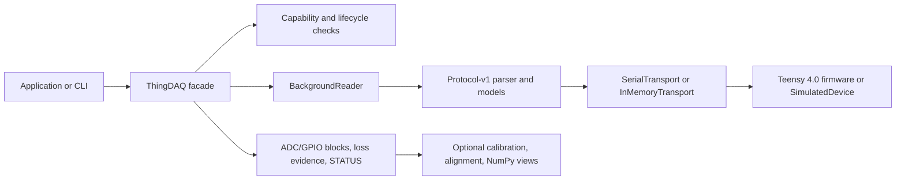
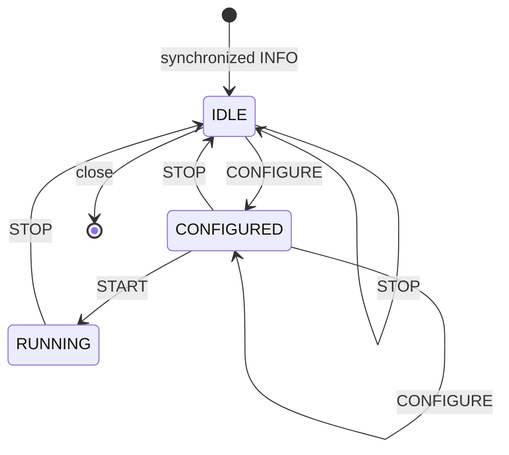

# Python API architecture

> [!IMPORTANT]
> Release 1.1.0 uses [[Protocol-V2]]: 450 MHz core, both ADCs and GPIO at
> 1 MHz, with 8 or 16 GPIO inputs. Phase-numbered results and legacy v1
> examples below are historical; their 600 MHz / 4 MHz claims are not current
> release settings. Use live INFO metadata. `TimestampAligner` does not support
> the new unequal-duration ADC/GPIO frames; use block sample timestamps.

The public host boundary is the synchronous, typed `ThingDAQ` facade plus
immutable data/evidence models exported from `thingdaq`. Normal callers do
not construct frames, own request IDs, run a parser, or coordinate a reader
thread. Those expert primitives remain available in the explicitly named
`thingdaq.low_level` namespace.

## Layering

`SerialTransport` and `InMemoryTransport` implement the same bounded byte
interface. `SimulatedDevice` consumes and emits encoded protocol frames; it is
not a direct model shortcut. Consequently simulator workflows exercise the
same request correlation, checksums, parser chunking, block construction,
queueing, capability validation, and cleanup used by serial hardware.

## Open and identity boundary

Physical discovery starts with USB metadata filtering for PJRC USB Serial
`0x16C0:0x0483`. Metadata enumeration alone does not open ports. `discover()`
performs bounded, read-only INFO probes only on plausible candidates, discards
failed/busy/incompatible candidates, and returns `DiscoveredDevice` snapshots.

A port path is transient. Stable selection uses INFO's nonzero, fuse-derived
`hardware_serial`; the USB decimal serial is cross-checked when available.
`ThingDAQ.open()` reopens the selected current endpoint and requires two
identity-equal INFO responses through its own reader before mutation. Physical
identity must be Teensy 4.0/i.MX RT1062, protocol v1 or v2, firmware at least 0.3.0,
nonzero serial, and a source-derived `thingdaq-<16 hex>` build ID.
`ExpectedDeviceIdentity` optionally pins exact serial, firmware, build, board,
MCU, and protocol values.

On reopen, `SessionRecoveryPolicy.ADOPT` preserves a valid CONFIGURED state and
can attach to a RUNNING epoch after STATUS establishes its run/configuration
evidence. `STOP` instead forces a bounded IDLE boundary. Attaching mid-run does
not fabricate a sequence-zero gap; pre-attachment loss remains firmware
counter evidence.

## Capability-driven CONFIGURE

`DeviceInfo.capabilities` is the validated authority for:

- supported stream, source, checksum, and exact source/stream profile masks;
- fixed protocol/frame/timestamp properties;
- advertised ADC/GPIO rates (both 1 MHz in release 1.1.0), ADC resolution/range, and 500 ns phase;
- physical pin/resource/layout metadata; and
- optional diagnostics and RESET/PING capability bits.

Before sending CONFIGURE, `ThingDAQ.configure()` requires a legal local state
and rejects any requested stream, source, checksum, or exact profile absent
from INFO. Optional `adc_pair_rate_hz`, `gpio_sample_rate_hz`, and
`adc_resolution_bits` keywords are exact capability requirements. They are
validated before the write and must describe an enabled stream.

Rates/resolution are not hidden wire fields. Protocol v1's CONFIGURE body is
exactly stream mask, one common source, data checksum, reserved zero, and
4,096-byte frame size. This keeps fixed capability metadata separate from
mutable selection. On success, firmware echoes the exact eight-byte applied
body. The facade stores that response and rejects any difference from the
request. START must echo the same applied body again before stream activation.

## State and cleanup

The public lifecycle is:

INFO, STATUS, and STOP are valid in every post-boot state. CONFIGURE and
RESET_STATS require IDLE/CONFIGURED; START requires CONFIGURED; block reads
require the RUNNING epoch activated by that facade. Diagnostics apply their
own capability and quiescence restrictions.

`ThingDAQ` is a typed context manager. Normal exit attempts STOP when the
device is CONFIGURED/RUNNING, then terminates the background reader and closes
the transport under finite bounds. Exceptional exit preserves the body error
while still attempting cleanup. `close(stop=False)` is explicit advanced
behavior for one-shot tools that intentionally leave device state unchanged.
`DAQShutdownError` retains STOP and reader failures plus recovery evidence.

## Reader and bounded ownership

One `BackgroundReader` owns transport reads, the incremental parser, correlated
control responses, and bounded data/event queues. It performs large reads but
accepts arbitrary transport fragmentation. Complete immutable payload bytes
are passed into typed blocks; callers never borrow mutable serial buffers.

The decoded-block queue has a fixed capacity. Its production policy drops the
oldest complete data block under application backpressure and emits an exact
`HostQueueLoss` report. Firmware acquisition/packet drops, host decoded-queue
drops, parser corruption, and protocol anomalies stay separate; one domain is
never relabeled as another.

## ADC model

`ADCBlock` owns one immutable 4,048-byte payload containing 1,012 little-endian
`(ADC0, ADC1)` pairs. `adc0` and `adc1` are lazy strided views, and `pair()`
preserves converter identity. The block carries actual INFO/STATUS metadata:
source, hardware serial, resolution/range, firmware initialization calibration,
trigger evidence, pair period, ADC1 phase, and latest acquisition status.

For pair `n`, ADC0's nominal tick is `t0 + 8n`; ADC1's is `t0 + 8n + 4`.
`interleaved()` yields explicit `AdcSample` objects in that order. It creates a
denser nominal grid only; it does not claim simultaneous sampling, true analog
aperture separation, or increased analog bandwidth.

Raw channels are permanent. [[Calibration]] adds immutable, identity-bound
host coefficients and opt-in voltage views without modifying codes, payload,
timestamps, loss evidence, or firmware metadata. [[NumPy-Integration]] adds
optional read-only zero-copy pair/channel arrays and explicit allocated
operations without becoming a baseline dependency.

## GPIO model

`GPIOBlock` owns 4,048 packed bytes. Each byte is a nominal simultaneous
D6-D13 input snapshot at 1 MHz in release 1.1.0: D6 is bit 0 and D13 is bit 7.
Auxiliary INPUT adds D16–D23 in bits 8–15 of each little-endian 16-bit sample. `samples` and
`payload_view` retain the packed representation. `channel(pin)` returns one
lazy Boolean view, so ordinary reads do not expand four million bytes per
second into eight Boolean arrays. Sample `n` has nominal tick `t0 + 2n`.

## Combined timestamp alignment

ADC and GPIO frames each cover 8,096 ticks in one START-relative epoch.
`TimestampAligner` pairs blocks by run and interval without copying either
payload. It accepts typed `StreamGap` announcements, retains bounded
out-of-order intervals, and emits `AlignmentLoss` when one source never
arrives. `AlignedInterval` exposes both original blocks and nominal seconds.
No alignment API adds measured pad propagation or analog aperture latency.

## Loss and health policy

The default `strict=False` mode keeps live delivery moving while emitting:

- `StreamGap` for sequence/timestamp discontinuity and any firmware flag;
- `HostQueueLoss` for application queue eviction; and
- `StreamAnomaly` for duplicate, reordered, stale-run, inconsistent-time, or
  contradictory telemetry.

`strict=True` raises typed `Unexpected*` errors at those boundaries. In either
mode, `loss_counters()` preserves firmware counters, host reader/parser/queue
counters, observed reports, and telemetry disagreements. `status()` supplies
live target evidence, `reconcile_run_counters()` proves the detailed firmware
conservation equations, and `validate_stream_health()` is the concise zero-loss
gate used by examples and strict CLI capture.

## Error boundary

Public exceptions distinguish state errors, unsupported capabilities, device
command errors, timeouts, disconnection, identity mismatch, shutdown failure,
stream gaps/anomalies/validation, calibration mismatch, and transport errors.
Actionable messages name the rejected operation and expected state or
advertised value. Timeouts and terminal reader failures retain immutable
`RecoveryEvidence` so identity, state, configuration, run, STATUS, and host
counters survive a failed exchange.

See [[API-Reference]] for names and signatures, [[Quickstart]] for runnable
workflows, [[Protocol-V1]] for the wire authority, and [[Hardware-Safety]] for
the physical boundary and tested-versus-untested claims.
